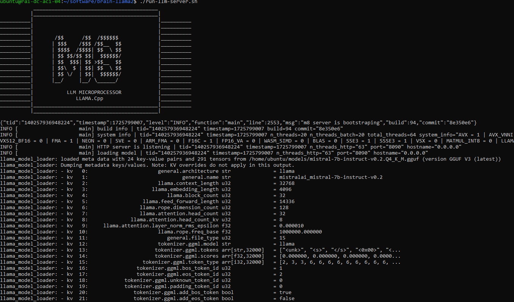
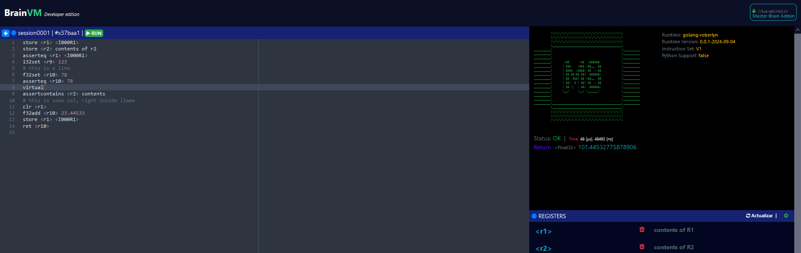

# The M8 Microprocessor C++ Implementation


```
          |\/\/\/\/\/\/\/\/\/\/\/\/\/\/\/\/\/\/\/\/\|
          |/\/\/\/\/\/\/\/\/\/\/\/\/\/\/\/\/\/\/\/\/|
          |\/\/\/\/\/\/\/\/\/\/\/\/\/\/\/\/\/\/\/\/\|
          |_________________________________________|
__________|                                         |__________
__________|                                         |__________
__________|                                         |__________
__________|       /$$      /$$  /$$$$$$             |__________
__________|      | $$$    /$$$ /$$__  $$            |__________
__________|      | $$$$  /$$$$| $$  \ $$            |__________
__________|      | $$ $$/$$ $$|  $$$$$$/            |__________
__________|      | $$  $$$| $$ >$$__  $$            |__________
__________|      | $$\  $ | $$| $$  \ $$            |__________
__________|      | $$ \/  | $$|  $$$$$$/            |__________
__________|      |__/     |__/ \______/             |__________
__________|                                         |__________
__________|           LLM MICROPROCESSOR            |__________
__________|                                         |__________
__________|_________________________________________|__________
          |_________________________________________|
          |\/\/\/\/\/\/\/\/\/\/\/\/\/\/\/\/\/\/\/\/\|
          |/\/\/\/\/\/\/\/\/\/\/\/\/\/\/\/\/\/\/\/\/|
          |\/\/\/\/\/\/\/\/\/\/\/\/\/\/\/\/\/\/\/\/\|
```


This is the m8 c++ codebase implementation. Supporting the full instruction set
and developed in tandem with the golang codebase.

This implementations is based off llama.cpp and ships the whole llama runtime inside the M8 interpreter/VM.

The vm codebase is in [m8p core](./m8p).
The server is [here](./tools/m8p-server)

## Build
BUILD README IS [here](./docs/build.md)
We use the same build toolchain as llama, then type:

```make llama-server```

## Run daemon
``` ./run-m8-daemon.sh 2&> ~/m8logs.txt```

### Daemon Logs
``` tail -f ~/m8logs.txt```

### Debugger session
``` gdb --args ./llama-server -m ~/models/gemma-gguf/gemma-2b-it.gguf -t 20 --port 9500 --host 0.0.0.0```

## Start M8 flavoured llama-server
Again same commands as llama-server:
```
./llama-server -m ~/models/mistral-7b-instruct-v0.2.Q4_K_M.gguf  -t 20 --port 8090 --host 0.0.0.0
```

## Instrumentation
All Params passed to llama-server can be acessed thru the ```llama_params``` instruction, just specify the output register;

example:
```asm
llama_params <r1>
assertcontains <r1> LLAMA_VERSION_
ret <r1>
```

```
TODO: INCLUDE THE INSTRUCTION/INSTRUMENTATION SET LIST
```

```
TODO: INCLUDE THE LLAMA.CPP MODEL INSTRUCTION SET LIST
```

```
TODO: INCLUDE THE INFERENCE2 INSTRUCTION SET LIST
```

```
TODO: INCLUDE THE OTHERS INSTRUCTION SET LIST
```

A lot of stuff to do.

Ships with these routes alongside the llama-server traditional:
- POST ```/api/v1/m8/dry-run``` - Run a temporary execution (M8 instance is destroyed after request finished and all resources released)

- POST ```/api/v1/m8/session-create/:id_session``` - Create a persistent session.

- POST ```/api/v1/m8/session-check/:id_session``` - Conditionally create a persistent session.

- POST ```/api/v1/m8/session-destroy/:id_session``` - Destroys a persistent session.

- GET ```/api/v1/m8/session-stats/:id_session``` - Details on persistent session.

- GET ```/api/v1/m8/session-activity``` - active online sessions.

- POST ```/api/v1/m8/session-run/:id_session``` - Run inside a persistent session.

## Show Time

The M8 runtime is very fast. instructions typically run in the microseconds range.
given proper advantages to built performant abstractions and apis.




## Runtimes

Three implementations are under development:
- Golang (default, ref implementation)
- Native Python/C++ *(this repo)*
- JVM Implementation

## Goals

- Video ACCELERATION
- Native CPU Inference Support (x86_64)
- Native Support for IMR (Intermediate Memory) & MGR (MemoryGroups)
- CUDA 12.1-12.4 SUPPORT
- 3D GPU ACCELERATION
- LOW LATENCY VOICE CIRCUIT
- NervePublish (BrainVM Powered)
- LLMCORE Inference2 {Inference, Classification, Tokenization}

## Modules

Important work is carried out in these modules:
- COMPILER
- VIRTUAL MACHINE
- INSTRUCTION SET
- CONCURRENCY
- LOCKING
- REGISTERS & MNEMONICS
- CORES & MODULE
- MEMORY SYSTEM
- BUS

## EDITIONS OR VERSIONS
- stable: barren golang runtime, light, optimal for customization
- pyvm: Includes a python vm inside the golang runtime
- cppvm: Implements a native c/c++ engine  *(this repo)*
- brainvm: Includes the whole brain env

## EXAMPLE

```cpp
#include <iostream>
#include <string>
#include <ctime>
#include "m8p.h"

int main(int argc, char ** argv) {
    m8p::M8System *m8 = m8p::M8P_Instance("m8-instance");
    std::string P1 = "clr <r1>   \n"
                    "store <r1> <I000R1>  \n"
                    "store <r2> <I000R2_VALUE_OF_2>  \n"
                    "store <r3> <I000R3_VALUE_OF_3>  \n"
                    "store <r4> <VALUE OF 4 IS DYNAMIC NOW alaksdalksdj l asldkjalkd ajlkd aksldjaksldjaskdj lkasdad asd>  \n"
                    ;

    std::pair<m8p::M8_Error, m8p::M8_Obj*> Ret = m8p::Run(m8, P1);

    // looks like an error ocurred on execution
    if (Ret.first.Type!=m8p::M8_Err_nil.Type) {
        std::cout << "ERROR: " << Ret.first.Details;
    } else {
        std::string sType=0;
        int32_t i32Value=0;
        float f32Value=0;
        std::string sValue = ""

        if (Ret.second!=nullptr) {
            sType = m8p::TypeStr(Ret.second->Type);
            if (Ret.second->Type==m8p::MP8_I32) {
                i32Value = Ret.second->I32;
            } else if (Ret.second->Type==m8p::MP8_F32) {
                f32Value = Ret.second->F32;
            } else {
                sValue = Ret.second->Value;
            }
        } 
    }

    // destroy m8 instance and release resource
    // ATTENTION: DO NOT USE m8 before calling M8P_INSTANCE again
    m8p::DestroyMP8(m8);
    m8 = nullptr;
}
```

### BUILD

More options:
- [Build for Intel](./docs/intel.md)
- [Build on Android](./docs/android.md)
- [Performance troubleshooting](./docs/development/token_generation_performance_tips.md)
- [GGML tips & tricks](https://github.com/ggerganov/llama.cpp/wiki/GGML-Tips-&-Tricks)

In order to build llama.cpp you have four different options.

- Using `make`:
  - On Linux or MacOS:
      ```bash
      make
      ```

  - Notes:
    - For `Q4_0_4_4` quantization type build, add the `GGML_NO_LLAMAFILE=1` flag. For example, use `make GGML_NO_LLAMAFILE=1`.
    - For faster compilation, add the `-j` argument to run multiple jobs in parallel. For example, `make -j 8` will run 8 jobs in parallel.
    - For faster repeated compilation, install [ccache](https://ccache.dev/).
    - For debug builds, run `make LLAMA_DEBUG=1`

- Using `CMake`:

  ```bash
  cmake -B build
  cmake --build build --config Release
  ```

  **Notes**:

    - For `Q4_0_4_4` quantization type build, add the `-DGGML_LLAMAFILE=OFF` cmake option. For example, use `cmake -B build -DGGML_LLAMAFILE=OFF`.
    - For faster compilation, add the `-j` argument to run multiple jobs in parallel. For example, `cmake --build build --config Release -j 8` will run 8 jobs in parallel.
    - For faster repeated compilation, install [ccache](https://ccache.dev/).
    - For debug builds, there are two cases:

      1. Single-config generators (e.g. default = `Unix Makefiles`; note that they just ignore the `--config` flag):

      ```bash
      cmake -B build -DCMAKE_BUILD_TYPE=Debug
      cmake --build build
      ```

      2. Multi-config generators (`-G` param set to Visual Studio, XCode...):

      ```bash
      cmake -B build -G "Xcode"
      cmake --build build --config Debug
      ```
    - Building for Windows (x86, x64 and arm64) with MSVC or clang as compilers:
      - Install Visual Studio 2022, e.g. via the [Community Edition](https://visualstudio.microsoft.com/de/vs/community/). In the installer, select at least the following options (this also automatically installs the required additional tools like CMake,...):
        - Tab Workload: Desktop-development with C++
        - Tab Components (select quickly via search): C++-_CMake_ Tools for Windows, _Git_ for Windows, C++-_Clang_ Compiler for Windows, MS-Build Support for LLVM-Toolset (clang)
      - Please remember to always use a Developer Command Prompt / PowerShell for VS2022 for git, build, test
      - For Windows on ARM (arm64, WoA) build with:
        ```bash
        cmake --preset arm64-windows-llvm-release -D GGML_OPENMP=OFF
        cmake --build build-arm64-windows-llvm-release
        ```
        Note: Building for arm64 could also be done just with MSVC (with the build-arm64-windows-MSVC preset, or the standard CMake build instructions). But MSVC does not support inline ARM assembly-code, used e.g. for the accelerated Q4_0_4_8 CPU kernels.

## Metal Build

On MacOS, Metal is enabled by default. Using Metal makes the computation run on the GPU.
To disable the Metal build at compile time use the `GGML_NO_METAL=1` flag or the `GGML_METAL=OFF` cmake option.

When built with Metal support, you can explicitly disable GPU inference with the `--n-gpu-layers|-ngl 0` command-line
argument.

## BLAS Build

Building the program with BLAS support may lead to some performance improvements in prompt processing using batch sizes higher than 32 (the default is 512). Support with CPU-only BLAS implementations doesn't affect the normal generation performance. We may see generation performance improvements with GPU-involved BLAS implementations, e.g. cuBLAS, hipBLAS. There are currently several different BLAS implementations available for build and use:

### Accelerate Framework:

This is only available on Mac PCs and it's enabled by default. You can just build using the normal instructions.

### OpenBLAS:
- [Check Guide](./docs/openblas.md)

### BLIS
Check [BLIS.md](./backend/BLIS.md) for more information.

### INTEL
- [See Guide](./docs/intel.md)

### CUDA
- [See Guide](./docs/cuda.md)

### MUSA
- [See Guide](./docs/musa.md)


### hipBLAS
- [See Guide](./docs/hipblas.md)

### VULCAN
- [See Guide](./docs/vulcan.md)

### CANN
- [See Guide](./docs/cann.md)

### Android

To read documentation for how to build on Android, [click here](./docs/android.md)


```
          |\/\/\/\/\/\/\/\/\/\/\/\/\/\/\/\/\/\/\/\/\|
          |/\/\/\/\/\/\/\/\/\/\/\/\/\/\/\/\/\/\/\/\/|
          |\/\/\/\/\/\/\/\/\/\/\/\/\/\/\/\/\/\/\/\/\|
          |_________________________________________|
__________|                                         |__________
__________|                                         |__________
__________|                                         |__________
__________|       /$$      /$$  /$$$$$$             |__________
__________|      | $$$    /$$$ /$$__  $$            |__________
__________|      | $$$$  /$$$$| $$  \ $$            |__________
__________|      | $$ $$/$$ $$|  $$$$$$/            |__________
__________|      | $$  $$$| $$ >$$__  $$            |__________
__________|      | $$\  $ | $$| $$  \ $$            |__________
__________|      | $$ \/  | $$|  $$$$$$/            |__________
__________|      |__/     |__/ \______/             |__________
__________|                                         |__________
__________|           LLM MICROPROCESSOR            |__________
__________|                                         |__________
__________|_________________________________________|__________
          |_________________________________________|
          |\/\/\/\/\/\/\/\/\/\/\/\/\/\/\/\/\/\/\/\/\|
          |/\/\/\/\/\/\/\/\/\/\/\/\/\/\/\/\/\/\/\/\/|
          |\/\/\/\/\/\/\/\/\/\/\/\/\/\/\/\/\/\/\/\/\|
```
