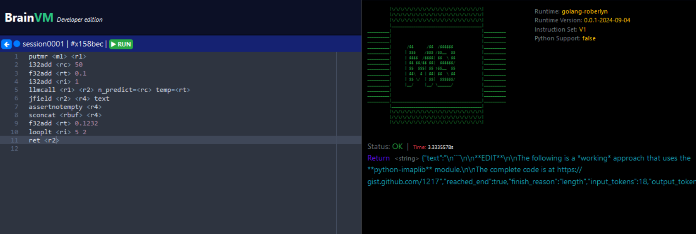

# The M8P Microprocessor


M8P is a virtual machine designed to build and run sophisticated AI Systems. It is a glorified wrapper as it is an architectural shift. M8P treats AI operations—like inference, vector search, matrix operations, and embedding—as native first class instructions.

Built on a robust C++ codebase, M8P combines llama.cpp, an HNSW Vector DB, and AVX2/AVX512 optimizations into a single runtime environment. This allows for zero-copy latency and atomic "thought loops" that others frameworks will find hard to match.


This implementations is based off llama.cpp and ships the whole llama runtime inside the M8 interpreter/VM.
The vm codebase is in [m8p core](./tools/server/m8p.h).
The server is [here](./tools/server)

## Build

First generate build conf (disable LIBCURL if you prefer)
```bash
cmake -B build -DLLAMA_CURL=OFF  && cd build
```

generate  for NVIDIA GPU(disable LIBCURL if you prefer)
```bash
cmake -B build -DLLAMA_CURL=OFF -DGGML_CUDA=ON && cd build
```

now check support for avx in you processor
```bash
lscpu
````


The ouputs of lscpu will give you the complete capabilities of machine processor.
According to your settings set the CXX_FLAGS according to your processor support for either avx2 or avx512 (default is avx2):

Then lets set support for avx:
```bash
cat > flags.cmake
# compile CXX with /usr/bin/c++
CXX_DEFINES = -DGGML_BACKEND_SHARED -DGGML_SHARED -DGGML_USE_CPU -DLLAMA_SHARED
CXX_INCLUDES = -I/workspace/m8p/tools/server -I/workspace/m8p/build/tools/server -I/workspace/m8p/tools/server/../mtmd -I/workspace/m8p -I/workspace/m8p/common/. -I/workspace/m8p/common/../vendor -I/workspace/m8p/src/../include -I/workspace/m8p/ggml/src/../include -I/workspace/m8p/tools/mtmd/.
## CHOOSE either -mavx2 or -mavx512f according to you lscpu
CXX_FLAGS = -O3 -DNDEBUG -Wmissing-declarations -Wmissing-noreturn -Wall -Wextra -Wpedantic -Wcast-qual -Wno-unused-function -Wno-array-bounds -Wextra-semi -mavx2
#CXX_FLAGS = -O3 -DNDEBUG -Wmissing-declarations -Wmissing-noreturn -Wall -Wextra -Wpedantic -Wcast-qual -Wno-unused-function -Wno-array-bounds -Wextra-semi -mavx512f
```

Build to enable AVX (Advanced vector eXtensions)
```bash
# change 17 for your processor count - 2 (ideally)
cp flags.make tools/server/CMakeFiles/llama-server.dir && make -j 17 llama-server
```

Build without AVX (Advanced vector eXtensions), example for inference only mat instructions wont be available
```bash
make -j 17 llama-server
```

# Run
If build successful.
```bash
./bin/llama-server -m ~/models/nomic-embed-text-v1.5.Q4_K_M.gguf  -t 4 --port 8090  --host 127.0.0.1  --jinja
```

# Some Models
https://huggingface.co/TheBloke/TinyLlama-1.1B-Chat-v1.0-GGUF/blob/main/tinyllama-1.1b-chat-v1.0.Q2_K.gguf
https://huggingface.co/nomic-ai/nomic-embed-text-v1.5-GGUF/blob/main/nomic-embed-text-v1.5.f32.gguf
https://huggingface.co/nomic-ai/nomic-embed-text-v1.5-GGUF/tree/main
https://huggingface.co/ggml-org/gemma-3-1b-it-GGUF/blob/main/gemma-3-1b-it-Q4_K_M.gguf

# Bonus

If you're in Ubuntu and dont have rcp, here's the command to install
```bash
apt-get update && apt-get install rsh-redone-client 
```

To which the output will be something like (for GPU):


MORE DETAILS ABOUT BUILD README IS [here](./docs/build.md)
We use the same build toolchain as llama.
[Visit Website](https://m8-site.desktop.farm)

```
          |\/\/\/\/\/\/\/\/\/\/\/\/\/\/\/\/\/\/\/\/\|
          |/\/\/\/\/\/\/\/\/\/\/\/\/\/\/\/\/\/\/\/\/|
          |\/\/\/\/\/\/\/\/\/\/\/\/\/\/\/\/\/\/\/\/\|
          |_________________________________________|
__________|                                         |__________
__________|                                         |__________
__________|                                         |__________
__________|       /$$      /$$  /$$$$$$             |__________
__________|      | $$$    /$$$ /$$__  $$            |__________
__________|      | $$$$  /$$$$| $$  \ $$            |__________
__________|      | $$ $$/$$ $$|  $$$$$$/            |__________
__________|      | $$  $$$| $$ >$$__  $$            |__________
__________|      | $$\  $ | $$| $$  \ $$            |__________
__________|      | $$ \/  | $$|  $$$$$$/            |__________
__________|      |__/     |__/ \______/             |__________
__________|                                         |__________
__________|           LLM MICROPROCESSOR            |__________
__________|                                         |__________
__________|_________________________________________|__________
          |_________________________________________|
          |\/\/\/\/\/\/\/\/\/\/\/\/\/\/\/\/\/\/\/\/\|
          |/\/\/\/\/\/\/\/\/\/\/\/\/\/\/\/\/\/\/\/\/|
          |\/\/\/\/\/\/\/\/\/\/\/\/\/\/\/\/\/\/\/\/\|
```
